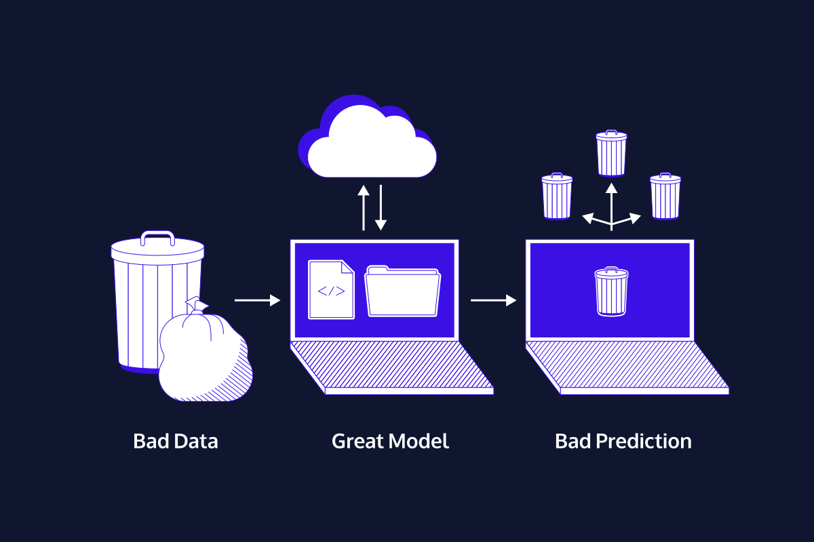
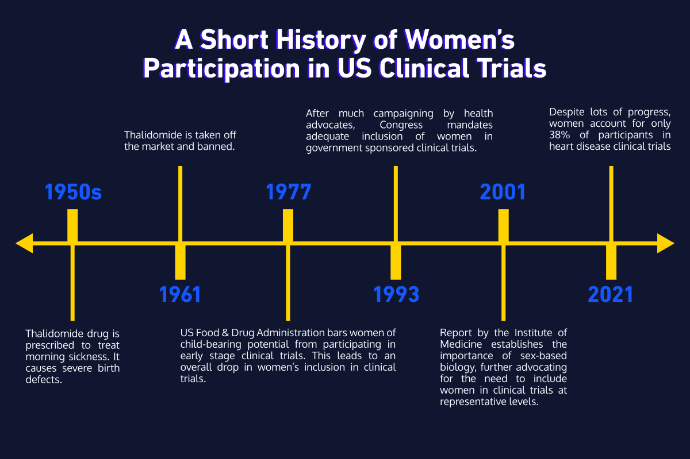
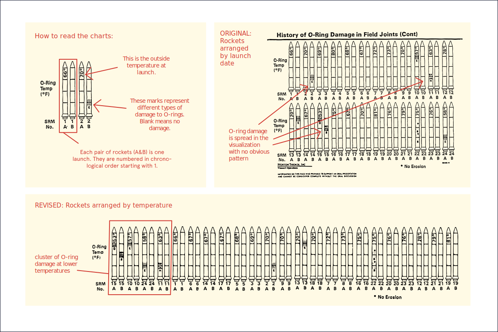

# Welcome to Data Literacy
## Establishing how to think about data will set you up for success when you start analyzing it.
### Data Literacy topics

Case studies about what can go wrong – and right in data projects.
Basic assumptions of working with different types of data.
How data types affect the analysis.
Foundational statistical ideas.
Key ideas behind good (and misleading) visualizations.
After this unit, you will be able to:

Spot messy data and make a plan to clean it.
Critically evaluate whether a statistical technique is a good idea.
Apply appropriate data manipulation methods.
Spot the difference between good and bad visualizations.
Make a plan for how to transform a bad visualization into a good one.
Reference classic case studies involving perfect and poor data analysis.

# Welcome to Data Literacy
## Why is data literacy important?
- How data literacy helped 19th-century doctors end cholera epidemics and discover the root cause of the disease.
- Data Litreracy helped reveal discrimination in hard-to-measure settings like hiring practices and advance medical knowledge by improving clinical trial data quality.
- Data literacy also helps us to produce readable work for other people. As we’ll see, even when good data is there, the inability to tell a clear story can have dire consequences.
- Data is an incredibly powerful tool.

Case Studies in Data Literacy
# Data Gaps

Garbage in, garbage out is a data-world phrase that means our data-driven conclusions are only as strong, robust, and well-supported as the data behind them.

For example: we have a lot of data on heart attacks, but there is still room for improvement when it comes to data quality. Heart disease is the leading cause of death in women, but as of 2021, women accounted for only 38% of participants in relevant research studies.

There are key differences between men’s and women’s heart attacks that affect how they are treated, but our data does not yet adequately capture those differences. That gap ultimately leads to worse treatment outcomes and a higher post-heart attack mortality rate for women.

How does data literacy factor in? Part of understanding and communicating with data is asking the right questions so we end up with useful, relevant data. We can already answer many questions about heart attacks, but we will not learn the ins and outs of women’s heart attacks by studying mostly men.

Part of practicing good data literacy means asking:

- Do we have sufficient data to answer the question at hand?
- Can my data answer my exact question?

### Image

These two questions are easier to act on when you can *see* where data is thin or missing. The figure below is one way to picture that gap.

# Addressing Bias

One question the data on heart attacks might prompt is: “Why did the trials have only 38% female participation?”

In part, for historical reasons: in the 1950s, pregnant women in Europe and Canada were prescribed a drug called thalidomide for morning sickness. The drug caused severe birth defects and was withdrawn from the market. As a result, in 1977 the US Food and Drug Administration (FDA) recommended excluding from early-stage clinical trials all women who could become pregnant. While intended to protect women, the recommendation put them at risk in a different way, by limiting our knowledge of how drugs affect women’s bodies.

The FDA reversed these recommendations in the 1990s, and today government-funded clinical trials must include women and other minorities. Yet trials do not need to include minority groups at representative levels, and the majority of drug trials in the US are not government-funded.

In this case, participation might also be shaped by media representation. In typical TV or movie heart attacks, we almost always see a man clutching his arm or chest. Not only do women have heart attacks too (we would not know it from watching TV), they rarely experience chest pain as a symptom.

(In fact, in the top 20 “heart attack” movies\* on IMDb, only two heart attacks happen to women: one is fake, and the other is a disguised murder. So… zero real heart attacks in women in a list of top 20 “heart attack” movies!)

It might seem like a stretch from data literacy to TV heart attacks, but sound science means examining bias and controlling variables wherever possible.

Part of practicing good data literacy means asking:

- Who participated in the data?
- Who is left out?
- Who made the data?

\*Top movies with the keyword “heart attack” where a heart attack is actually mentioned or shown in the movie—not *The Exorcist*, which is on that list because people have had heart attacks while watching it… yikes!

### Image

The timeline below lines up key moments in this story—from thalidomide and the 1977 FDA guidance through later shifts in trial policy—so you can see how policy and data collection evolved together.

# What is Statistics?

Now let’s look at a case study that showcases the value of data literacy in the legal system.

Big, amorphous injustices like hiring discrimination are hard to prove in court. Hiring discrimination is a pattern of biased behavior toward candidates. That bias results in qualified candidates not being hired because of their traits.

Throughout the 1900s, companies in the US were able to justify hiring on a case-by-case basis. After all, it is legal to hire or not hire candidates based in part on soft qualities such as “fit” and “office culture.” But if those qualities mask factors like a candidate’s race, gender, or religion, the company has broken anti-discrimination laws.

Usually, a lawyer would have to show many individual cases proving a company was discriminatory. Instead, lawyer Elaine W. Shoben shifted the burden of proof to companies. How was she able to do this with data literacy? She used the power of statistics. Statistics helps us judge whether what we observe is likely due to random chance or to a systematic pattern.

What does that actually mean? For example, you are more likely to see more cars on the road at 8 a.m. on Wednesday than at 8 a.m. on Sunday. That is not a random occurrence—the increase in traffic lines up with rush hour and standard business hours. It is statistically more likely to see many cars during rush hour than at other times.

We’ll see in the next exercise exactly how Elaine Shoben used statistics to change how we assess bias in hiring.

### Image

Traffic can look messy, yet it still follows recurring timing and structure. The clip below is a simple visual cousin of the rush-hour example: statistics is partly about separating a pattern like that from pure coincidence.

# Statistics at Work

So how did Elaine Shoben show that discrimination was at play in hiring decisions? It is a bit heavy on the legal jargon, but we can break it down to see how it works.

First, she argued that we can use statistics to see whether the hiring results of subjective interviews are so unlikely that they could not have happened by chance. In other words, is it even possible (in statistical terms) that the pattern of who got the job could be based on random chance?

If the results could not have happened by chance, then the alternative is that they must happen by “purposeful exclusion.” In other words, it would mean people are excluded from the job by discriminatory hiring practices.

If employers are aware of the “exclusionary effect,” and they continue to use that same hiring process, then they are showing a “reckless disregard” for the rights of individual candidates not to be discriminated against in the hiring process. (Read it a few times if you need to!)

Once we acknowledge that, the burden shifts to employers to show why their hiring requirements are valid and necessary. We no longer assume the hiring practices are legitimate and make job candidates prove otherwise.

Statistics at work! That is definitely a bit of legal jargon—but how cool is it to use statistics to reveal a systematic pattern of discrimination, rather than trying to piece together a case from individual experiences? That is really what statistics is all about.

## Logic step 1 : Could the hiring results have happened by random chance? Or is that statistically impossible?
Example: Step 1
In the last 5 years, StarComm Corporation had 1,000 candidates and hired 200 people. Of the 1,000 candidates, 400 were women (40%). Of the 200 people hired, only 20 were women (10%).

## Logic step 2 : If the hiring results have happened by chance they must have happened by "purposeful exclusion"
Example: Step 2
Statisticians determine that the probability of getting these hiring results by chance is essentially zero. Lawyers can then conclude that the low number of women hired isn't accidental, but purposeful in some way.

## Logic step 3 : If the employer is aware of this "purposeful exclusion" they show "reckless disregard" for the rights of individual candidates not to be discriminated against.
Example: Step 3
StarComm Corporation is now aware that their hiring practice discriminates against women. So lawyers can argue that SCC violated the rights of women candidates to have a fair shot (without discrimination) in the hiring process.

## Logic step 4: The burden of proof shifts to the employer to prove why hiring requirements are valid and necessary.
Example: Step 4
The burden is now on StarComm Corporation to get its hiring process into legal shape OR to prove why its hiring process has to be the way it is. It's no longer the job of individual women candidates to prove they are up against an unfair process.

# High Stakes Visualizations

Okay, we’ve walked through recognizing data quality and bias in healthcare and using statistics to answer big legal questions. Where else does data literacy come into play?

Data visualization is one of the most visible and obvious places we interact with data. It helps us explore and understand data-driven arguments and is a powerful tool for communication.

While most data visualization we see is of the “everyday” variety, in this case study we’ll look at a highly consequential visualization: one of the charts that NASA-contracted engineers used to argue that the Challenger space shuttle should not launch on January 28, 1986.

The Challenger carried seven US astronauts who were supposed to deploy a satellite and study Halley’s Comet while in orbit. Less than two minutes after liftoff, however, the shuttle exploded, killing all seven crew members.

The explosion was caused by a failure of two O-rings: small rubber rings that helped create an airtight seal between the space shuttle and its launch fuel supply. Before the launch, engineers were concerned about how the low-temperature forecast would affect the O-rings’ ability to make a proper seal.

The engineers made their arguments in favor of postponing the launch using, in part, a series of data visualizations that showed launch success rates at various temperatures. Tragically, their arguments did not prevent the launch from proceeding.

### Image

The Challenger story is a stark reminder that how we show data can carry life-or-death weight. The figure below is a simple space-themed illustration to pair with this case.

# The Challenger Visualizations

Before we pick apart this visualization, it is worth saying that hindsight is 20/20. If it were as simple as “obviously, the O-rings were going to fail,” then the Challenger would never have been launched. This event was the culmination of several years of context, not an isolated incident, so many other factors were at play.

Following the incident, a Presidential Commission was initiated to investigate the causes of the catastrophe. The commission determined that the disaster was directly the result of O-ring failure. However, the commission also concluded that management from both NASA and Morton Thiokol (the company NASA had contracted to design and maintain its rocket boosters) had ignored evidence that indicated significant risk of O-ring failure at low launch temperatures. Additionally, the commission noted that NASA and Morton Thiokol had failed to adequately test the equipment they were using, despite consistent requests from engineers for several years preceding the incident.

In short, it is unlikely that this particular visualization played a pivotal role in the decision-making conversation that ended with management deciding to launch as scheduled.

From a data literacy standpoint, though, we can definitely see how a better visualization would make the trend of the data more apparent. The engineers had the data to know that O-rings began to fail at lower temperatures. But their visualization was not created in a way that made that danger clear.

The visualization of rocket launches was organized by date, which made it hard to see the pattern of launch failures at lower temperatures (see the top-right image). When Edward Tufte later organized the rockets by temperature, that pattern became much more obvious (see the lower image). Additionally, including all of the rocket symbols for decoration did not make the argument clearer, but instead added distracting visuals to the page.

The visualization would have been easier to interpret with fewer distracting lines and a more direct link between temperature and launch failures.

While most of us will (thankfully) never be in the position of making or interpreting life-or-death data visualizations, good data literacy helps us make informed decisions every day. Should I bring an umbrella? Should I postpone my trip to avoid public health risks? Should I buy stock in Blockbuster? Whatever the questions, improving our data literacy can help us reach the answers.

### Image

Tufte’s reorganization of the launch data (temperature on one axis, clearer grouping) illustrates how the same facts can read very differently depending on layout—compare the discussion above with the figure below.

